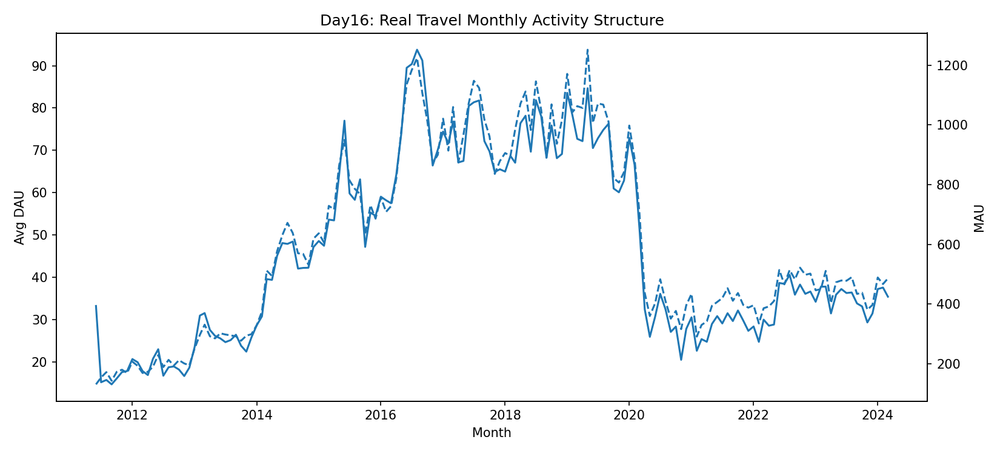
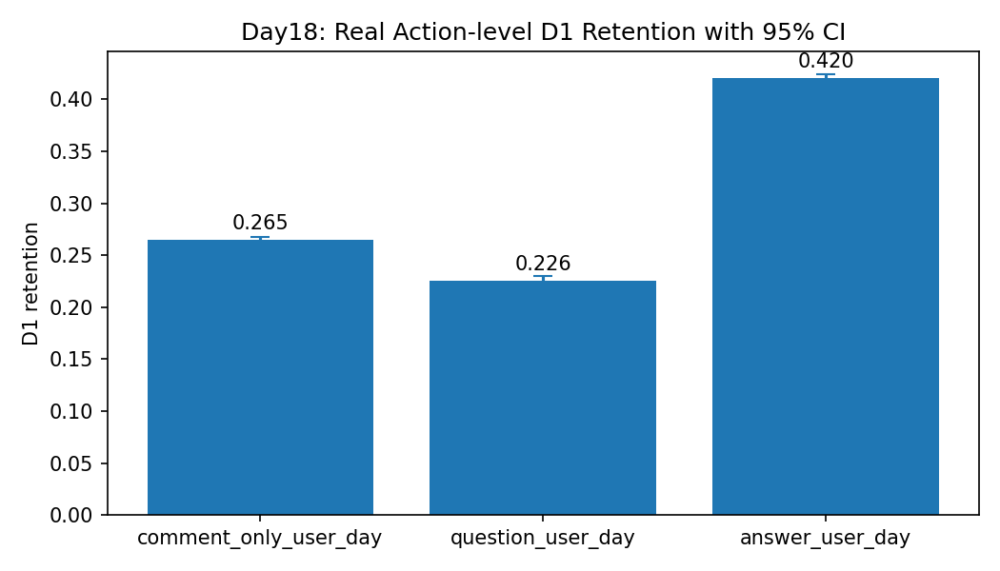
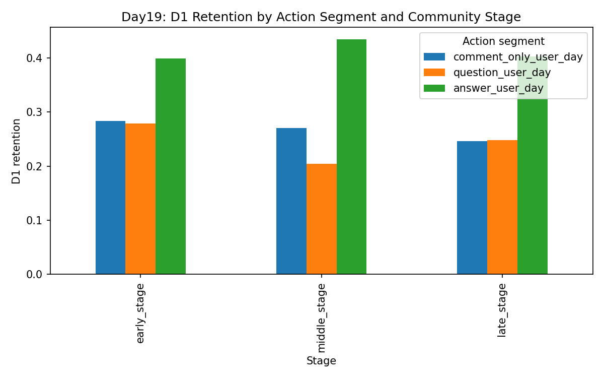

# Community Retention & Behavioral Depth Analysis on Travel Stack Exchange

A real-world community analytics project using public behavioral data from Travel Stack Exchange to study how **community scale**, **short-term retention**, and **participation depth** interact over time.

## Executive Summary

Using **414,791 real events**, **40,600 users**, and **214,923 user-days** from **2011 to 2024**, this project found that:

- **community growth and user stickiness did not peak at the same time**
- **answer-oriented contribution showed the strongest next-day retention (~42%)**
- this retention advantage remained **stable under confidence intervals and cross-stage comparison**

> **Community quality should not be measured only by activity scale, but also by the depth and type of participation behind that activity.**

---

## Key Highlights

- **Scale vs. stickiness diverged**: peak MAU, peak DAU, and peak D1 retention occurred in different periods
- **Behavior mattered**: `answer_user_day` retained at **42.0%**, vs **26.5%** for `comment_only_user_day` and **22.6%** for `question_user_day`
- **The pattern held across stages**: answer behavior remained the highest-retention segment in early, middle, and late community stages

---

## Featured Visuals

### 1. Monthly Activity Structure

*This chart shows that community scale and retention did not peak at the same time: MAU peaked in 2019, while monthly average D1 retention peaked much earlier.*

### 2. Action-Level Retention with Confidence Intervals

*This chart shows that answer-oriented contribution had the highest D1 retention, and that the gap remained stable under narrow confidence intervals.*

### 3. Retention by Community Stage

*This chart shows that the retention advantage of answer-related behavior remained visible across early, middle, and late community stages.*

---

## Data Source

- **Platform:** [Travel Stack Exchange](https://travel.stackexchange.com/)
- **Download:** [Stack Exchange Data Dump (Internet Archive)](https://archive.org/details/stackexchange)
- **Raw format:** XML
- **Core files used:**
  - `Posts.xml`
  - `Comments.xml`
  - `Users.xml`
- **Time range:** 2011-06-21 to 2024-03-31

---

## Business Questions

This project focuses on four questions:

1. How large and active is the community over time?
2. Does peak community scale coincide with peak short-term retention?
3. Are different participation behaviors associated with meaningfully different retention outcomes?
4. Are those differences stable across community stages?

---

## Dataset Summary

- **Source:** Travel Stack Exchange public data dump
- **Time range:** 2011-06-21 to 2024-03-31
- **Events:** 414,791
- **Users:** 40,600
- **User-days:** 214,923

### Event types
- `question`
- `answer`
- `comment`

---
## How to Reproduce

### Install dependencies

```bash
pip install -r requirements.txt
```

### Prepare raw data

Download the Travel Stack Exchange dump from the data source above, extract the archive, and place the XML files under:

```text
data/travel_stackexchange_raw/
```

Expected files:
- `Posts.xml`
- `Comments.xml`
- `Users.xml`

### Run the real-data workflow

From the project root:

```bash
python src/day14_build_real_travel_user_day.py
python src/day15_real_dau_and_d1_retention.py
python src/day16_real_time_series_structure.py
python src/day17_real_retention_by_action.py
python src/day18_real_action_retention_stability.py
python src/day19_real_action_retention_by_stage.py
```

## Analytical Workflow

### Phase 1 — Method Building on Toy Data
A toy dataset was first used to establish a rigorous analytical workflow, including:

- D1 retention calculation
- action-level comparison
- confidence interval estimation
- base-size sensitivity checks
- cohort comparison
- stratified validation
- transition analysis
- baseline predictive modeling

### Phase 2 — Real-World Community Analysis
The workflow was then migrated to the real Travel Stack Exchange dataset:

1. Build raw event table from XML
2. Construct user-day behavioral table
3. Measure DAU and D1 retention
4. Analyze monthly activity and retention structure
5. Segment behavior into participation-depth groups
6. Validate retention differences using base size, bootstrap CI, and stage comparisons

---

## Key Findings

### 1. Growth and Stickiness Did Not Peak at the Same Time
- **Peak MAU:** 2019-05
- **Peak monthly average DAU:** 2016-08
- **Peak monthly average D1 retention:** 2011-06

This suggests that **community growth and user stickiness are related, but not equivalent**.

### 2. Contribution-Oriented Behavior Had the Strongest Retention
Action-level D1 retention showed a clear hierarchy:

- **answer_user_day:** **42.0%**
- **comment_only_user_day:** **26.5%**
- **question_user_day:** **22.6%**

This indicates that deeper content contribution was much more strongly associated with short-term retention than lightweight interaction or demand-driven participation.

### 3. The Difference Was Stable
The retention gap remained stable under:

- **large base sizes**
- **bootstrap confidence intervals**
- **cross-stage comparison**

For example:

- answer: **58,509** base user-days, **95% CI = [41.6%, 42.5%]**
- comment-only: **113,682** base user-days, **95% CI = [26.2%, 26.7%]**
- question: **42,732** base user-days, **95% CI = [22.2%, 23.0%]**

### 4. The Pattern Also Held Across Community Stages
The community timeline was split into:

- **early stage:** 2011–2014
- **middle stage:** 2015–2019
- **late stage:** 2020–2024

Across all three stages, `answer_user_day` remained the highest-retention behavior segment.

---

## Actionable Insights

If this community were managed as a product, the findings suggest several practical directions:

1. **Prioritize contributor retention, not just total activity**
   - The strongest short-term retention comes from answer-oriented contribution, not from overall activity volume alone.

2. **Design incentives for first-time or early answerers**
   - Answer-related participation appears to align with higher-quality retention.
   - Product teams could test badges, recognition systems, or contributor nudges aimed at users who show early answer behavior.

3. **Track retained contributors as a health metric**
   - Peak MAU and peak retention did not coincide.
   - This suggests teams should track not only total active users, but also retained high-value contributors.

4. **Differentiate demand-side and supply-side behaviors**
   - Asking questions and answering questions likely reflect different user roles and lifecycle positions.
   - Product decisions should avoid treating all activity as equally valuable.

## Business Interpretation

If Travel Stack Exchange is viewed as a community product, this project suggests:

- not all activity has equal retention quality
- contribution-oriented behavior is more strongly associated with user stickiness than simple activity volume
- growth teams should distinguish between:
  - demand expression
  - lightweight interaction
  - high-value contribution

---

## Repository Structure

```text
community_retention/
├── data/              # processed datasets and outputs
├── figures/           # exported charts
├── notes/             # analysis notes and delivery documents
├── src/               # analysis scripts
├── .gitignore
├── requirements.txt
└── README.md

```
## Limitations

This is still an observational project, so the findings should be interpreted carefully.

Key limitations include:

- no direct view or impression logs are available in the public dump
- behavior-retention relationships are correlational, not causal
- answer-oriented users may systematically differ from question-oriented users in **tenure, familiarity, contribution readiness, or historical engagement level**
- therefore, the relationship between action type and retention should be interpreted as **associational rather than causal**
- stage definitions are analytically useful but manually defined